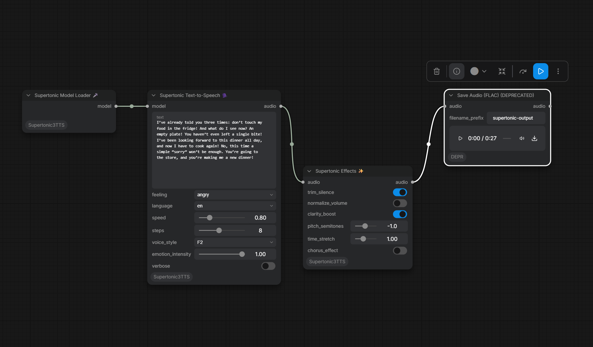

# ComfyUI-Supertonic3TTS

A suite of [ComfyUI](https://github.com/comfyanonymous/ComfyUI) custom nodes integrating **Supertone's Supertonic-3** — a lightning-fast, on-device, multilingual Text-to-Speech system running natively via ONNX Runtime.



The screenshot shows the customized ComfyUI interface with `feeling` and `emotion_intensity`. These fields record a requested emotion; they do not provide native Supertonic emotion conditioning. The screenshot's Save Audio (FLAC) node is marked deprecated; use an available current audio save node for new workflows.

---

## 📦 Nodes

| Node | Input | Output | Description |
|------|-------|--------|-------------|
| **Supertonic Model Loader** 🎤 | — | `SUPERTONIC_MODEL` | Initialises the TTS engine. Auto-downloads ~400MB model on first run, stored locally in `models/`. |
| **Supertonic Text-to-Speech** 🗣️ | `model`, text, language, voice, speed, steps, feeling, emotion_intensity | `AUDIO` | Synthesises speech with 31 languages and 10 preset voices. Feeling and intensity are workflow metadata. |
| **Supertonic Effects** ✨ | `audio` | `AUDIO` | Optional post-processing (trim, normalize, pitch, stretch, chorus). Apply to any `AUDIO` source. |

---

## ✨ Features

### Supertonic TTS

- **31 languages** — `en`, `ko`, `ja`, `id`, `ar`, `de`, `es`, `fr`, `hi`, `vi`, and more
- **10 built-in voices** — M1–M5 (male), F1–F5 (female)
- **Feeling and intensity parameters** — Select `feeling` and `emotion_intensity` (0.0–1.0, default 0.5) to record the requested emotion in workflow/job parameters. Supertonic currently does not apply these values to the generated audio.
- **Speed control** — Native SDK speed parameter (0.5x – 2.0x). For finer post-synthesis tempo tweaks, use the SupertonicEffects `time_stretch` slider.
- **Steps** — Diffusion steps (5–12, default 8). Higher = smoother, slower.
- **CPU-friendly** — Runs entirely on CPU via ONNX Runtime, no GPU required
- **Local model cache** — Model files stored in `models/supertonic-3/` inside this node's directory (not `~/.cache/`)

### Pipeline

```
┌──────────────┐    ┌────────────────────────────┐    ┌──────────────┐
│   text +     │ →  │     SupertonicTTS          │ →  │   AUDIO      │
│  language    │    │ (lang, voice, speed, steps)│    │              │
└──────────────┘    └─────────────┬──────────────┘    └──────┬───────┘
                                  │                            │
                                  │       ┌──────────────┐     │
                                  └─────→ │ SupertonicEffects│ ←─┘
                                          │ (trim/pitch/etc)│
                                          └──────┬────────┘
                                                 ▼
                                          Preview / Save Audio
```

---

## 🎭 Feeling and intensity

The customized workflow interface uses these controls:

| Parameter | Values | Meaning |
|-----------|--------|---------|
| `feeling` | `neutral`, `happy`, `sad`, `angry`, `surprised`, `fearful`, `disgusted` | Requested emotion, stored in the workflow/job parameters. |
| `emotion_intensity` | Minimum `0.0`, maximum `1.0`; default `0.5`; increment `0.05` | Requested intensity: none, medium, or maximum. |

Supertonic does not consume an emotion or emotion-intensity argument. These controls are workflow metadata and do not change the audio. Tags such as `<angry>`, `<sad>`, and `<laugh>` are not supported emotion commands in the installed SDK. Detecting a tag in a log does not establish emotion conditioning.

`voice_style`, `speed`, and the separate Effects node affect the voice or generated audio, but do not provide a native emotion-intensity control.

---

## 🚀 Installation

### Requirements

- ComfyUI (any recent version)
- Python 3.10+

### 1. Clone the repository

```bash
cd ComfyUI/custom_nodes/
git clone https://github.com/masterzion/ComfyUI-Supertonic3TTS.git
```

### 2. Install Python dependencies

**Activate your ComfyUI virtual environment first**, then:

```bash
pip install -r ComfyUI-Supertonic3TTS/requirements.txt
```

### ComfyUI Manager is already!
you can install it on comfyui-manager!

> **Note:** `torch` and `torchaudio` are **not** listed in requirements.txt — they are inherited from ComfyUI itself. Only `supertonic`, `numpy`, `soundfile`, and `librosa` are required on top of ComfyUI's base dependencies.

### 3. Restart ComfyUI

The nodes will appear under **`audio/Supertonic`** in the node menu.

> **First run only** — the Loader auto-downloads the ~400MB Supertonic-3 model into `models/supertonic-3/`. A clean 0–100% slider shows progress in the console. Subsequent loads skip the download.

---

## 🎮 Usage

### Basic TTS Pipeline

1. Add **Supertonic Model Loader** (no inputs needed)
2. Add **Supertonic Text-to-Speech**
3. Connect the model from step 1
4. Type the text you want spoken
5. Configure: language, voice, speed, steps
6. Add **Preview Audio** or **Save Audio** to hear the result
7. Run the workflow

### Add post-processing

Wire the TTS `AUDIO` output into **Supertonic Effects**, then into Preview/Save. Adjust pitch / stretch / chorus as needed.

### Set feeling and emotion intensity

In the customized interface shown above, select `feeling`, then set `emotion_intensity` between `0.0` and `1.0`. The screenshot uses `angry` with intensity `1.0`, voice `F2`, and speed `0.80`. Choose the preset voice using `voice_style`.

Restart the ComfyUI backend after changing custom-node Python code, then refresh the browser and reload a workflow saved for that node schema. ComfyUI saves widget values by position; loading a workflow from a different schema can put `angry` into `language` or shift the numeric fields. Confirm the labels and values before running it.

### Speed vs Time Stretch

- **SupertonicTTS `speed`** changes tempo *during* synthesis (model-aware, cleanest).
- **SupertonicEffects `time_stretch`** uses phase vocoder after synthesis (any source, slight artifacts at extremes).
- Combine both: SDK `speed` first, then Effects `time_stretch` on the output. Effective tempo ≈ `speed × time_stretch`.

---

## 🌍 Supported Languages

| Code | Language | Code | Language | Code | Language |
|------|----------|------|----------|------|----------|
| `en` | English | `ko` | Korean | `ja` | Japanese |
| `ar` | Arabic | `bg` | Bulgarian | `cs` | Czech |
| `da` | Danish | `de` | German | `el` | Greek |
| `es` | Spanish | `et` | Estonian | `fi` | Finnish |
| `fr` | French | `hi` | Hindi | `hr` | Croatian |
| `hu` | Hungarian | `id` | Indonesian | `it` | Italian |
| `lt` | Lithuanian | `lv` | Latvian | `nl` | Dutch |
| `pl` | Polish | `pt` | Portuguese | `ro` | Romanian |
| `ru` | Russian | `sk` | Slovak | `sl` | Slovenian |
| `sv` | Swedish | `tr` | Turkish | `uk` | Ukrainian |
| `vi` | Vietnamese | `na` | Unknown / fallback | |

---

## 📄 License

Code: MIT License
Model: OpenRAIL-M License (Supertone)

Supertonic: Copyright (c) 2026 Supertone Inc.

This fork is maintained at [masterzion/ComfyUI-Supertonic3TTS](https://github.com/masterzion/ComfyUI-Supertonic3TTS), based on [Anonymzx/ComfyUI-Supertonic3TTS](https://github.com/Anonymzx/ComfyUI-Supertonic3TTS).
